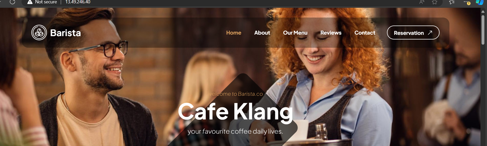

# Capstone Project-Introduction to Cloud Computing 

## E-commerce platform Platform Deployment with Git, Linux . and Aws

### project Instructions:
This project will develop an e-commerce website for a new online marketplace name "MarketPeak" This platform will feature product listings,  shopping cart, and user authentication . To develop this project i will use git for version control , the development platform will be linux evironment and deploy it on an Aws EC2 instance.

# Step 1: Development on Local environment 

### Task 1: Implement version control with Git 
1.1 Initialize Git repository :  I will creates project directory or folder "MarketPeak_Ecommerce". Cd into the new project directory and git init

### Task2 : Obtain and Prepare the E-Commerce Website Template

2.1.   I don't have to develope the website code, that work is for web/software developers. Instead of developing the website from scratch, I will use a pre- existing e-commerce website template.

2.2 Download a Website Template: Visit (Tooplate)[https://www.tooplate.com/] or any other free template resource, and download a suitable e-commerce website template. Look for templates that are ready to use and require minimal adjustments. It is recommended you download the specific template

### 2.3 : ls

- ls command is used to list the content of a directory.

2.4 : Git Status

- The git status command in which git is used to display the state of the working directory and the staging area

2.5 : Git Add 
- The git add command is for moving changes from the working directory to the staging area.

- Set your Git global configuration with your username and email.

- commit your changes with a clear, descriptive message.

2.6 : Push the code to your Github repository

- Create a Remote Repository on GitHub: log into your github account and create a new repository named " MarketPeak_Ecommerce" Leave the repository empty without initalizing it with a README ,.gitignore, or license.

- Link your Local Repository to GitHub: In your terminal , within your project directory, add the remote repository URL to your local repository configuration

- Push your Code : Upload your local repository content to GitHub

# Step 2: AWS Deployment 

### Task 1: Set Up an AWS EC2 Instance

 - Log in to the AWS Management Console
 - Launch an Ec2 instance using an Amazan Linux AMI.
 - Connect to the instance using SSH.
 - Note that I used my existing security group that has both port 22  opened. I also used existing keypair
 

 ### Task 2: Clone the repository on the Linux Server
 Before deploying your e-commerce platform , you need to clone the GitHub repository to your AWS EC2 instance.This process involves authenticating with Github and choosing between two primary methods of cloning a repository : SSH and HTTPS.

 ### 2.1 Authenticating with GitHub using ssh

   - On your EC2 instance , generate SSH keypair using ssh-keygen.
   

   - cat and copy the public key 
   

   - Adding ssh public key to Github repository
   

   - Use the SSH clone URL to clone the repository

   

   Note: With AWS redhat . i will install git 

   - Sudo yum install git -y
   

   - Verify installation : After installation git --version
   

   - Git clone from Remote Repository to Local Repository.
    git clone command is used to make a copy of an existing git repository from remote to local machine .
    Note the basic syntax for using git clone 
    

    

   ### Task 3: Installing a Web Server on EC2

   Apache HTTP Server is a widely used wed server that serves HTML files and content over the internet . Installing it on the Linux EC2 server allows you to host MarketPeak E-commerce site:

   3.1 Install Apache webserver on the EC2 instance . Note that httpd is the software name for Apache on systems using yum package manager

   

   3.2 Configure Httpd for Website
   - Prepare the Web Directory: Clear the default httpd web directory and copy MarketPeak Ecommerce website files to it

   

   - Reload httpd: Apply the changes by reloading the httpd service.
   

   - Edit Inbound rules : Open port 80 for httpd .

### Task 4 : Access Website from Browser
 With httpd configured and website filesin place . MarketPeak ECommerce platform is now live on the internet: Open a web browserand access the public IP(1353.127.108) of your EC2 instance to view the deployed website

 

 # Step 3: Continous Integration and Deployment Workflow
 ### To ensure a smooth workflow for developing, testing , and deploying your e-commerce platform, follow this structured approach, It covers making changes in a development environment . utilizing version control with git , and deploying updates to your production server on AWS.

  ### Task 1: Developing New Features and Fixes

  - Create a Development branch : begin your development work by create a separate branch . This isolates new features and bug fixes from the stable version of the your website.

  

  1.1 :Git Status 

  The git status command in git is used to display the state of the working directory and the staging area

  

  ### Task 2: Version Control with Git
 Stage your changes : After making your changes , add them to the staging area in Git . This prepares the changes for a commit.

 2.2: Git Add

 The git add command is for moving changes from the working directory to the staging area

 

 2.3 : Git Commit 

 The git commit command is used to save changes in the git repository by creating a snapshot of the staged changes.

 git commit -m "Add new features or fix bugs"

 

 2.4 : Push Changes to GITHUB : Upload your    development branch with the new changes to Github . This enables collaboration and version tracking.

 

 ### Tasks 3: Pull Requests and Merging to the Main branch

 - Create a Pull Request (PR): On GitHub, create a pull request to merge the development branch into the main branch . This process is crucial for code review and maintaining code quality.
 

 ### Tasks 3.1 Review and Merge the PR: Review the changes for any potential issues. once satisfied , merge the pull request into the main branch, incorporating the new features or fixes into the production codebase.

 

 - git checkout master
 - git merge developmet

 

 

 3.2 : Push the Merged Changes to GitHub : Ensure thet your local main branch, now containing the updates, is pushed to the remote repository on GitHub .

 
 

 ### Tasks 4 Dploying Updates to the Production server

 - PUll the latest changes on server : SSH into AWS EC2 Instance where the production website is hosted. Navigate to the website's directory and pull the lastest changes from the main branch

 

 4.1 : Restart the Web Server : Depending on the nature of the updates, you may need to restart the web server to appyly the changes

 - Sudo systemctl reload httpd

 ### Task 5 : Testing the New Changes 

 - Accessing the Website ; Open a web browser and navigate to the public Ip address of your EC2 instance . Test the new feature or fixs to enable the work as expected in the live environment .

 This workflow emphasizes best practices in software development and deployment , including branch management , code review through pull requests , and continuous integration/ deployment strategies. By following these steps , you maintain a stable and up-to -date production environment for your e-commerce platform
 

